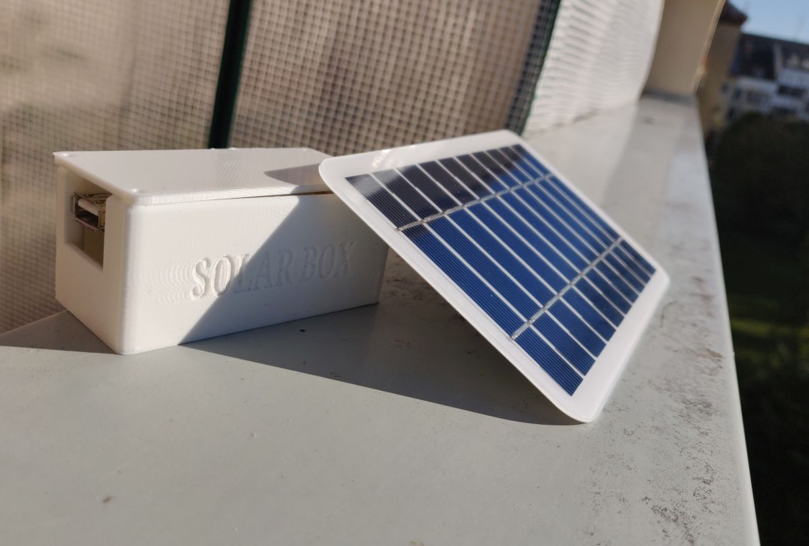
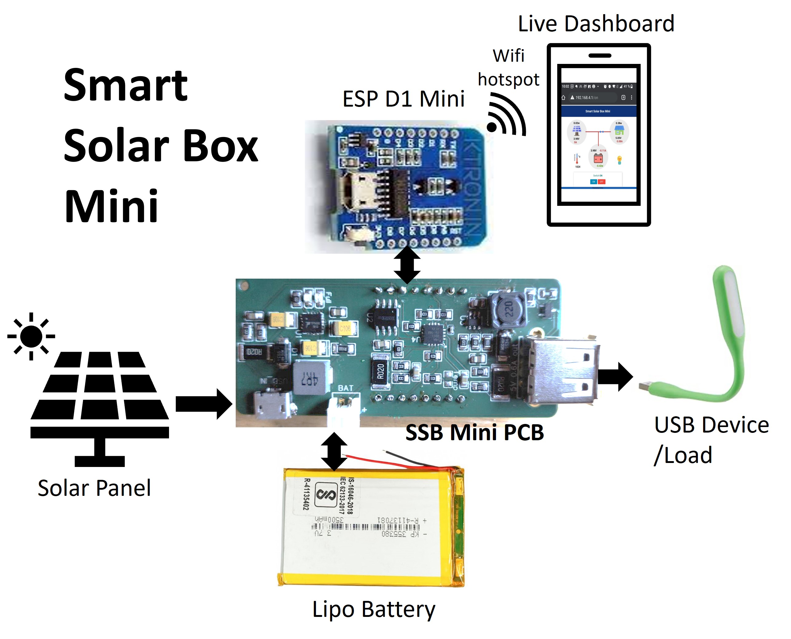
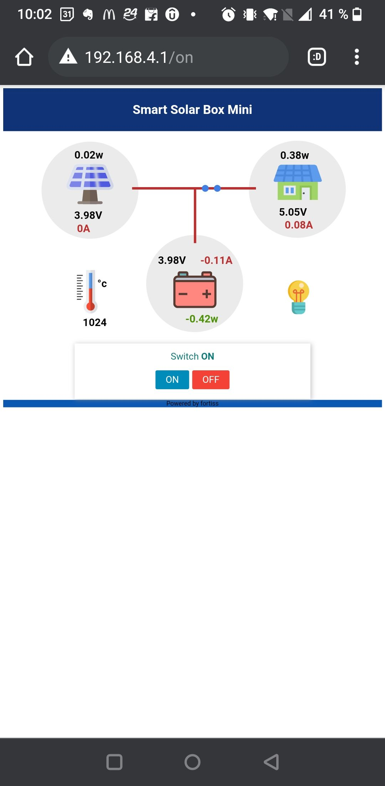

# SmartSolarBoxMini

Smart Solar Box is a smart and intelligent solar power storage unit with monitoring and control capabilities.This is an education project designed for kids and students to learn about Solar photovoltaic energy and battery technology. The smart solar box is composed of a power system and an information system. It has four main elements: SSB mini PCB, ESP8266 D1 Mini, a solar panel, and a battery. 

The solar panel absorbs solar radiation and turns it into direct-current electricity. SSB mini PCB consists of Battery charger IC that takes care of battery charging process. Boost converter converts battery voltage to 5V regulated output. INA3221 power monitoring IC monitors the power flow. ESP D1 mini communicates with SSB Mini PCB and runs the Solar Box live dashboard. D1 mini get the power from SSB mini pcb power line. ESP mini creates its own wifi hotspot so that smart phones/laptops could be connected and access the dashboard easily. 

This project aims at kids and students to learn about solar energy and battery storage technologies. Using the live monitoring dashboard, students can observe the power flow and readings. Activity and experiment sheets help students learn about various concepts related to sustainable energy, battery storage and solar energy.

Resources for pcb manufacturing and other required parts are present in "Hardware" folder

## Challenges:

- Component selection and BOM reduction was quite challenging as the project can be realized using various power management ICs and microcontrollers. Due to chip shortage, keeping the cost of the kit low and availability of major components were another major challenges. By Comparing huge list of components/IC iin the market in terms of their availability, prices and realiability, final BOM were selected and schematics were designed. 
- Writing a reliable code for Solar monitoring and control dashboard
- Various tests were performed in order to make it is safe to use and easy to assemble for kids.

